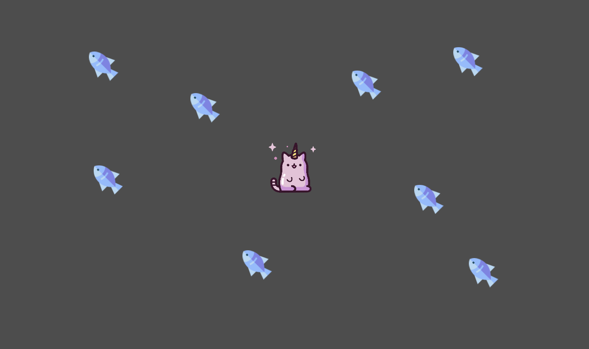

# simple-cat-game

A simple 2D cat game with the Godot engine.  
The original folder name was IntroToGodot.  
The course to create this simple game in Godot was provided by Zenva Academy.  
The course name was: Intro to Godot 4 Game development.

## Screenshot of the game

